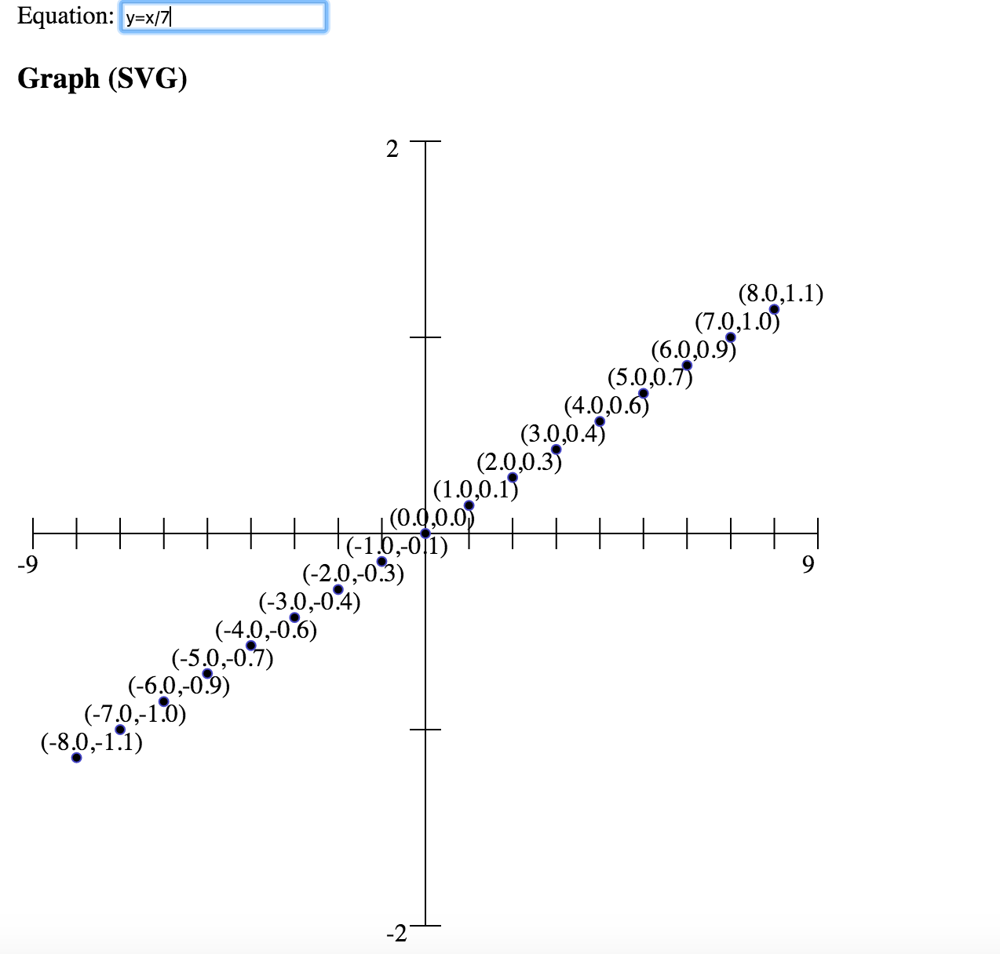

Linear Equation challenge
=====================================

The program allows a user to enter a simple linear equation into
a textbox whichthen generates data and a graph.

## Table of Contents

* [Requirements](#requirements)
* [First Use Instructions](#first-use-instructions)
* [Running the code](#running-the-code)

## Requirements

* In order to successfully run this sample app you need a few things:

1. Node JS

## First Use Instructions

1. Clone the GitHub repo to your computer
2. Configure the port

## Running the code

1. Node server.js

####Figure 1:

